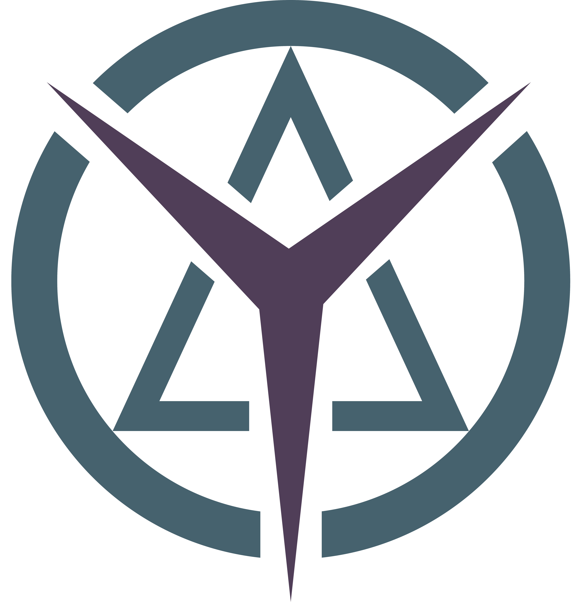

# YAKU

Yet Another Kernel and Userland - A hobby OS written as a school project

Table of contents
=================

<!--ts-->
   * [Citation](#Citing)
   * [Building](#build)
   * [Wiki](#wiki)
<!--te-->

## Build and Run
1. 'meson build'
2. meson compile kernel -C build qemu-run

## Functions
- Interrupt Handling
- Multitasking
- Window Manager
- 

## Wiki
<ul>
  <li>Drivers
    <ul>
      <a href="https://github.com/lennardwalter/yaku/wiki/PS2-Keyboard"><li>PS/2 Keyboard</li></a>
    </ul>
  </li>
</ul>

